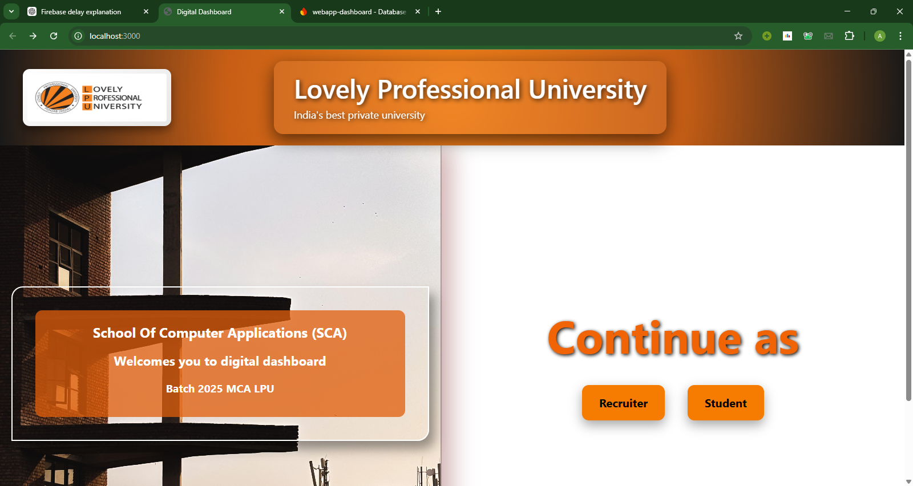
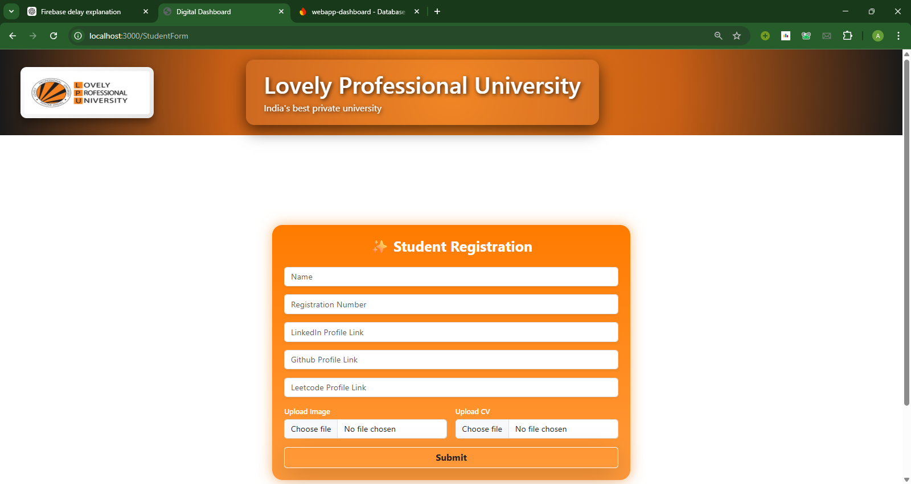
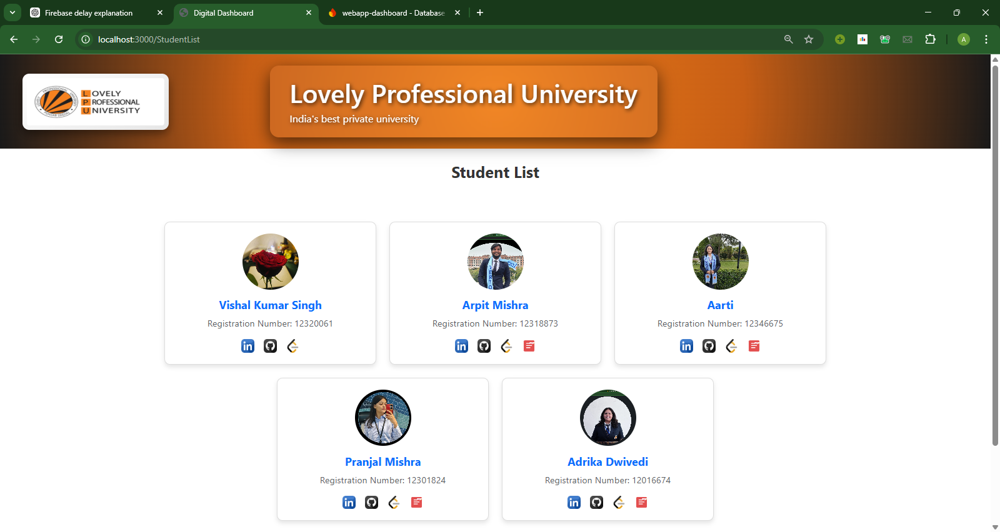

A responsive academic dashboard built using **React.js** and **CSS** to streamline student and recruiter interactions for the **MCA Batch of 2025 at Lovely Professional University (LPU)**.

---

---
## 📌 Features
- 📊 Responsive academic dashboard UI  
- 👩‍🎓 Student Portal for academic & profile interaction  
- 🧑‍💼 Recruiter Portal for viewing student data  
- 🔀 Dynamic Role-Based Navigation  
- ⚡ Fast performance & scalable architecture  
- 🎨 Clean, branded UI aligned with LPU identity  
- 🌐 Deployed on Vercel  

---
## Images
## 📸 Screenshots

  
  

  

